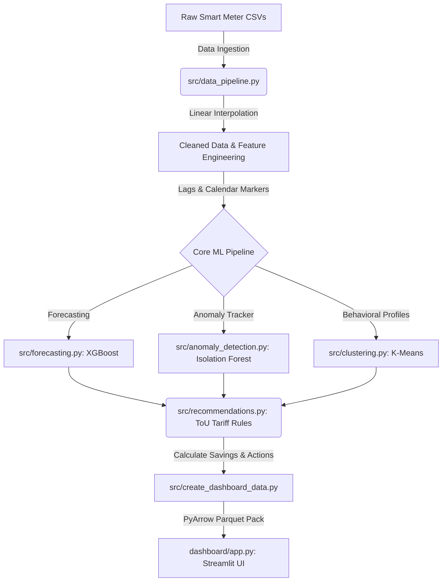

# ⚡ Autonomous Energy Optimization Platform

[](https://autonomous-energy-optimization-platform-for-smart.streamlit.app/)


An enterprise-grade, AI-powered decision support system built on time-series smart meter readings. The platform is designed to **"forecast consumption, identify usage patterns, and deliver optimization insights for smarter and more efficient energy management"**.

🔗 **Live Deployment**: [autonomous-energy-optimization-platform-for-smart.streamlit.app](https://autonomous-energy-optimization-platform-for-smart.streamlit.app/)

By integrating advanced machine learning pipelines (supervised time-series forecasting, unsupervised behavioral clustering, and multivariate anomaly detection), the platform transforms complex smart grid readings into plain-English savings recommendations under dynamic Time-of-Use (ToU) tariffs.

---

## 🔄 Platform Workflow

The platform processes data through a structured pipeline to convert raw time-series logs into actionable cost-saving recommendations:



1. **Data Ingestion**: Raw half-hourly consumption readings are ingested along with UK holidays and weather datasets.
2. **Preprocessing & Feature Engineering**: Missing values are resolved using linear interpolation. Lag features, rolling averages, and calendar coordinates (hour, day, weekend markers) are generated.
3. **Core ML Analysis**:
   - **Forecasting**: Gradient boosted regressors predict future consumption patterns based on temporal behaviors.
   - **Anomaly Tracker**: Isolation Forests flag usage spikes to trace malfunctions or potential grid leaks.
   - **Clustering**: K-Means groups homes by average 24-hour consumption shapes into behavioral cohorts.
4. **Dynamic Tariff Mapping**: Rule-based engines overlay dynamic Time-of-Use (ToU) tariffs to calculate potential bill savings.
5. **Presentation (Dashboard)**: Refined outputs are visualized in a Streamlit dashboard with custom CSS layouts and interactive Plotly figures.

---

## 🧰 Technology Stack & Design Rationale

To build a high-performance and explainable system, we selected specific machine learning models and frameworks:

* **XGBoost & Random Forest Regressors**: Chosen for forecasting because gradient boosted decision trees excel on high-dimensional tabular data. They capture complex non-linear relations (like weekend habits or weather spikes) far better than traditional linear time-series models (like ARIMA) which struggle with multiple seasonal cycles.
* **K-Means Clustering**: Selected to categorize 24-hour load shapes (48 features per household). K-Means groups households with similar routines (e.g., "Night Owls", "Low Consumers", "Evening Peak Users"), allowing utilities to design custom dynamic tariff incentives.
* **Isolation Forest**: Chosen for anomaly detection because smart meter datasets lack labels for faults or energy theft. Isolation Forest isolates anomalies in high-dimensional feature spaces rather than relying on basic statistical thresholds.
* **Streamlit**: Selected as the UI layer. It allows developers to build responsive web apps in pure Python, removing HTML/JS overhead while supporting styled components.
* **Plotly**: Used for vector-based charts. Unlike static plotting engines, Plotly supports interactive zooming, panning, and custom hover tips, which are essential for analyzing complex time-series data.
* **Pandas, NumPy & PyArrow**: Used for data manipulation. PyArrow Parquet formats enable compression and sub-second load times for datasets containing millions of rows.

---

## 🎓 Code Architecture Map (Mentor's Guide)

For reviewers looking to inspect the codebase structure and implementations, here is the file-by-file organization and what is written inside:

### 📂 Pipeline & ML Core (`src/`)

* **[src/data_pipeline.py](file:///c:/Users/dobil/Downloads/energy_project/src/data_pipeline.py)**
  - *Purpose*: The main entry point for data processing.
  - *Key Sections*: Coordinates the ETL pipeline. Loads raw datasets, handles missing values (using up to a 4-step linear interpolation threshold to preserve raw integrity), and splits data chronologically for time-series validation.
* **[src/forecasting.py](file:///c:/Users/dobil/Downloads/energy_project/src/forecasting.py)**
  - *Purpose*: Trains and compares time-series regression models.
  - *Key Sections*: Features XGBoost, Random Forest, and Linear Regression. Evaluates them using R², MAE, MAPE, and RMSE metrics, and outputs `forecast_model_comparison.csv` and `forecast_sample.csv`.
* **[src/anomaly_detection.py](file:///c:/Users/dobil/Downloads/energy_project/src/anomaly_detection.py)**
  - *Purpose*: Ensembles unsupervised anomaly detectors.
  - *Key Sections*: Combines multivariate Isolation Forest with univariate Z-Score. Flags power spikes and logs anomaly severities (Low, Medium, High) into `anomalies_detected.csv`.
* **[src/clustering.py](file:///c:/Users/dobil/Downloads/energy_project/src/clustering.py)**
  - *Purpose*: Performs household behavioral segmentation.
  - *Key Sections*: Standardizes consumption profiles across 48 half-hour daily slots, applies K-Means clustering, and labels households into categories. Saves outputs to `household_clusters.csv` and `cluster_summary.csv`.
* **[src/recommendations.py](file:///c:/Users/dobil/Downloads/energy_project/src/recommendations.py)**
  - *Purpose*: Renders savings calculations and recommendations.
  - *Key Sections*: Implements dynamic Time-of-Use tariff logic. It checks if households spike during peak hours (16:00 to 19:00) and calculates potential savings (£/month) by shifting usage to off-peak slots. Outputs `recommendations.csv`.
* **[src/create_dashboard_data.py](file:///c:/Users/dobil/Downloads/energy_project/src/create_dashboard_data.py)**
  - *Purpose*: Bundles pipeline datasets.
  - *Key Sections*: Merges the outputs of clustering, forecasting, and anomaly detection into a single `dashboard_data.parquet` package to accelerate web rendering.

### 📂 Presentation Console (`dashboard/`)

* **[dashboard/app.py](file:///c:/Users/dobil/Downloads/energy_project/dashboard/app.py)**
  - *Purpose*: Main Streamlit application file.
  - *Key Sections*: Configures sidebars, routes navigation tabs, imports layouts, and displays page modules (Home, Forecasting, Anomalies, Clustering, Advisor, Simulation).
* **[dashboard/charts.py](file:///c:/Users/dobil/Downloads/energy_project/dashboard/charts.py)**
  - *Purpose*: Plotly graphics implementation.
  - *Key Sections*: Contains functions to plot consumption distributions, model accuracy comparison, actual vs. predicted timelines, anomaly severity gauges, K-Means clustering distributions, and load curves.
* **[dashboard/prediction.py](file:///c:/Users/dobil/Downloads/energy_project/dashboard/prediction.py)**
  - *Purpose*: Backend controller for the "AI Advisor" page.
  - *Key Sections*: Extracts stats (average usage, risk level, dynamic savings) for a selected Household ID, renders result badges, and generates printable PDF-like CSV reports.
* **[dashboard/styles.py](file:///c:/Users/dobil/Downloads/energy_project/dashboard/styles.py)**
  - *Purpose*: CSS layout definitions.
  - *Key Sections*: Injects custom HTML templates for sidebar menus, metric widgets, and contains the `insight_card()` function to render plain-English analysis notes alongside charts.
* **[dashboard/data_loader.py](file:///c:/Users/dobil/Downloads/energy_project/dashboard/data_loader.py)**
  - *Purpose*: Memory-cached data utility.
  - *Key Sections*: Employs Streamlit caching (`@st.cache_data`) to prevent reloading large Parquet/CSV files on widget updates, maintaining a responsive user interface.

---

## 🚀 Non-Technical User Walkthrough

This guide explains how to use the platform from data ingestion to extracting optimization recommendations:

### Step 1: Data Ingestion
1. Place your half-hourly smart meter readings CSV under `data/halfhourly_dataset/` (e.g., `data/halfhourly_dataset/block_0.csv`).
2. Make sure your CSV contains these columns:
   - `LCLid`: Household ID (e.g., `MAC000002`)
   - `tstp`: Timestamp format (`YYYY-MM-DD HH:MM:SS`)
   - `consumption`: Electricity usage value in kWh
3. *If you do not have raw data*, run `python src/generate_sample_data.py` to generate synthetic data for immediate testing.

### Step 2: Running the Analytics Pipeline
Open your terminal and run:
```bash
python src/data_pipeline.py
```
This runs the ETL pipeline: cleaning data, running ML algorithms (XGBoost, Isolation Forest, K-Means), calculating savings, and exporting files to the `outputs/` folder.

### Step 3: Launching the Platform Console
Run the following command:
```bash
streamlit run dashboard/app.py
```
Open **http://localhost:8501** in your browser.

### Step 4: Exploring Console Insights
* **🏠 Home Page**: View aggregate statistics (total records, anomalous spikes, champion forecasting model) and review data distribution curves. Look for the **Data Distribution Insights** card at the bottom to understand usage spread.
* **📈 Forecasting Page**: Review model performance metrics. Under **Actual vs Predicted Consumption**, select a household ID to view how well the AI model tracks its daily routine.
* **🚨 Anomaly Detection Page**: View flagged energy spikes. Check the **Anomaly Timeline Insights** to inspect whether anomalies represent grid-wide power surges or individual appliance issues.
* **👥 Household Clustering Page**: View behavioral segmentation results. Look for the **Habits & Peak Load Ratios** to identify which cohorts draw the most energy during high-cost peak periods.
* **🤖 AI Advisor Page**: Select your household ID to view a personalized energy summary, including average usage, anomaly risk level (Low, Medium, High), and tailored dynamic ToU tariff shifting recommendations.
* **⚡ Simulation Page**: 
  - Adjust sliders (Base load, midday load, peak load, shift percentage) to see in real-time how the model classifies your cohort and estimates monthly savings.
  - Go to the **Batch CSV Uploader** tab to upload external meter CSV files and run immediate analytics.

---

## 💷 Tariff Assumptions & Dynamic Savings

The platform evaluates cost savings against the **London dynamic Time-of-Use (ToU) tariffs**:

| Tariff Period | Hours | Dynamic Rate |
|---|---|---|
| 🔴 Peak Hours | 16:00–19:00 | 67.20p / kWh |
| 🟢 Off-Peak Hours | 00:00–07:00 | 3.99p / kWh |
| 🟡 Normal Hours | All other times | 11.76p / kWh |

*Note: You can update these rates by modifying variables `PEAK_RATE`, `OFFPEAK_RATE`, and `NORMAL_RATE` in [src/recommendations.py](file:///c:/Users/dobil/Downloads/energy_project/src/recommendations.py).*
